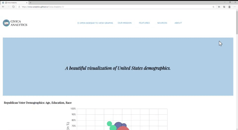
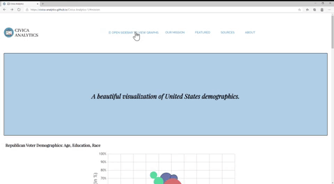
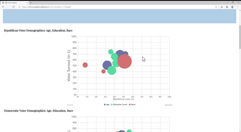

# Civica-Analytics
**By [Anahita Hassan](https://github.com/anahitahassan), [Kayley Seow](https://github.com/kayleyseow), [Swarnya Srivastava](https://github.com/Swarnya246), and [Natalie Zhou](https://github.com/nataliezhou)**   
  

## 📈What it does
Civica is a data visualization website, focusing specifically on voter data. On our website, we have 6 different visualizations displaying data and analysis from both Democratic and Republican parties.  

## 📈Inspiration  
One of our teammates recently read in her sociology textbook that people from the working class are more likely to be democrats, while it is the opposite for the upper class. This made her think: well, what other correlations like this are out there? This hackathon was the perfect opportunity for us to answer that question. Since the theme of this hackathon is civic engagement, we wanted to build a website that promoted political awareness, especially because of the upcoming election in November. Awareness is the first step to active engagement, and using graphs to visualize political data encourages voters to get involved in their community by voting.  

## 📈How we built it  
• Used HTML, CSS, and JS to construct the basic framework of the website as well as enhance aesthetically  
• We used Canvas JS to construct the interactive charts  
• The data was compiled from several esteemed research centers and government sources, including the U.S. Census Bureau, Pew Research Center, U.S. Elections Project, Kaiser Family Foundation, and Gallup News.  

## 📈Accomplishments that we're proud of, Challenges we ran into
We believe that our greatest accomplishment and challenge we overcame is how we were able to turn around our project and complete it in a matter of mere days. Originally, we attempted to use React JS, PHP, and MySQLi to build an interactive web app; however, we realized that completely familiarizing ourselves with React and building a fully functioning React app in a few days was unrealistic. Thus, we managed to work together to compile data and use Canvas JS to create seamless charts.  

## 📈What's next for Civica Analytics
• We hope to create a subscribe form in order to consistently publish current data about electorate trends, party affiliations, and demographics. This feature would have to be incorporated using a dynamic website, and languages such as PHP and MySQLi instead of just HTML, CSS, and JS.  
• Another next step for our project includes adding a map feature, which would allow a visitor to our website to find the closest polling center to either volunteer or vote at. This feature would be incorporated using Google Maps JavaScript API.  
• Along with more data visualization and graphs, another step for our project would be adding more resources for visitors of our website. For example, we could incorporate links to other websites with further information about how to vote in the upcoming election, news outlets that provide further updates, important upcoming dates, and more.  
• Most importantly, we hope to add more data!  

## 📈Data Sources
https://www.census.gov/data/tables/time-series/demo/popest/2010s-state-total.html  
http://www.electproject.org/2018g  
https://www.kff.org/other/state-indicator/distribution-by-raceethnicity/?currentTimeframe=0&sortModel=%7B%22colId%22:%22Location%22,%22sort%22:%22asc%22%7D  
https://news.gallup.com/poll/247025/democratic-states-exceed-republican-states-four-2018.aspx  

## 📈Demo  
Here are the gifs we used on our slides to demo our features. You can also see them on our website, but they are here in gif form just in case you don't feel like visiting the website. Don't worry, we understand, our gifs are pretty cool.  
### Scrollthrough the Civica Analytics Website
  
<h3>Civica Analytics Sidebar Demo</h3>
  
<h3>Civica Analytics Data Visualization Demo</h3>

